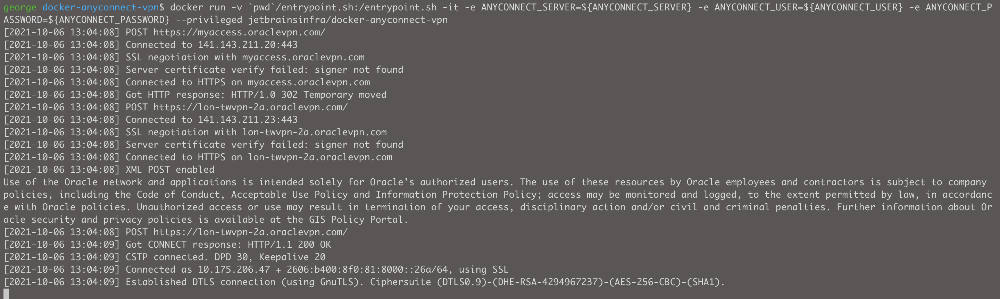

# How to use run Cisco AnyConnect client inside docker

```bash
#!/bin/sh
export ANYCONNECT_SERVER=
export ANYCONNECT_USER=
export ANYCONNECT_PASSWORD=

docker run -v `pwd`/entrypoint.sh:/entrypoint.sh -it -e ANYCONNECT_SERVER=${ANYCONNECT_SERVER} -e ANYCONNECT_USER=${ANYCONNECT_USER} -e ANYCONNECT_PASSWORD=${ANYCONNECT_PASSWORD} --privileged jetbrainsinfra/docker-anyconnect-vpn 

```

- Successful output from prompt shown below 

