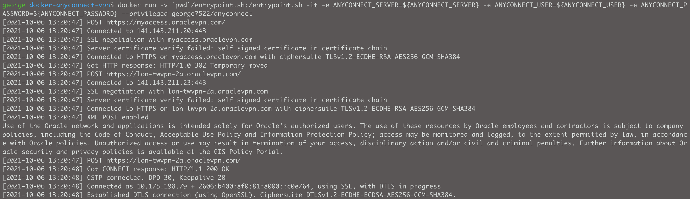

# How to use run Cisco AnyConnect client inside docker


[Dockerhub link](https://hub.docker.com/repository/docker/george7522/anyconnect)

This Dockerfile is a replica of jetbrainsinfra/docker-anyconnect-vpn plus SSH client.

```bash
#!/bin/sh
export ANYCONNECT_SERVER=
export ANYCONNECT_USER=
export ANYCONNECT_PASSWORD=

docker rm -f vpn ; 
docker run --name vpn -d -v ~/.zsh_history:/root/.zsh_history -v ~/.zshrc:/root/.zshrc:ro -v ~/.ssh:/root/.ssh:ro -e ANYCONNECT_SERVER=${ANYCONNECT_SERVER} -e ANYCONNECT_USER=${ANYCONNECT_USER} -e ANYCONNECT_PASSWORD=${ANYCONNECT_PASSWORD} --privileged george7522/anyconnect
docker exec -it vpn zsh

#Run commands to your VPN'ed network

```

- Successful output from prompt shown below 




## Example bash function for quick usage

```bash
# Usage:
# ~$ vpn 
# root /$ ssh root@myvpnprotectedserver

function vpn(){
        export ANYCONNECT_SERVER=myaccess.vpn.com;
        export ANYCONNECT_USER=myusername;
        export ANYCONNECT_PASSWORD='replaceme';
        docker rm -f vpn ; docker run --name vpn -d -v ~/.zsh_history:/root/.zsh_history -v ~/.zshrc:/root/.zshrc:ro -v ~/.ssh:/root/.ssh:ro -e ANYCONNECT_SERVER=${ANYCONNECT_SERVER} -e ANYCONNECT_USER=${ANYCONNECT_USER} -e ANYCONNECT_PASSWORD=${ANYCONNECT_PASSWORD} --privileged george7522/anyconnect
        sleep 3
        docker exec -it vpn zsh
}

```
